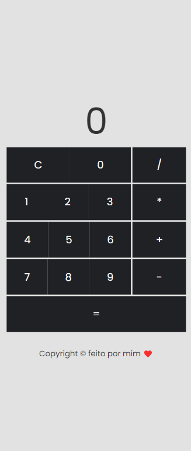

# Calculadora

<h4 align="center"> 
	🚧  Calculadora 🚀 Concluída  🚧
</h4>

Nesse projeto criei uma calculadora em um conceito minimalista utilizando Angular e Sass.

Esse projeto foi gerado com [Angular CLI](https://github.com/angular/angular-cli) version 13.2.3.

## Development server

Rode `ng serve` no terminal para abrir o ambiente de desenvolvimento na URL `http://localhost:4200/`.

<a href="http://profgabrielsalvador.com.br/">
 
  
 <b>Gabriel Salvador</b></a> <a href="http://profgabrielsalvador.com.br/" title="Rocketseat">🚀</a>

Feito com ❤️ por Gabriel Salvador 👋🏽 Entre em contato!

